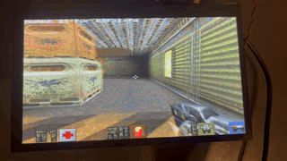

# ESP32_QUAKE2


A full **Quake 2** port for the **ESP32-P4** microcontroller, built on the
portable [`quake2generic`](https://github.com/ozkl/quake2generic) engine with
its software renderer (`ref_soft`). The classic first-person shooter
runs on a single chip: the game logic, the software 3D renderer and the audio
mixer all run bare-metal on the P4 while the hardware handles the heavy lifting
— Pixel-Processing-Accelerator upscaling and DMA audio.

This port targets the **ESP32-P4-Function-EV-Board** (with HMI-SubBoard), but
is designed to be **easily portable to other ESP32-P4 boards**: the P4-specific
logic lives in `main/` (display, audio, input, network) behind a thin
hardware-abstraction layer, while the engine in `components/quake2` is
board-agnostic — only the OSPI flash/PSRAM config in `sdkconfig.defaults` and
the BSP calls in `main/` need adapting.

## 🚀 Key Improvements

- **PPA Hardware Scaling**: The engine renders internally at `320x240` (8bpp
  paletted) and is upscaled to `1024x600` on the MIPI-DSI panel via the
  ESP32-P4's **Pixel Processing Accelerator**, freeing the CPU for game logic.
  The 8bpp → RGB565 conversion runs on core 1 while the game runs on core 0.
- **SIMD PIE Optimizations**: Custom `p4_memcpy` / `p4_memset` components that
  leverage the P4's **RISC-V PIE SIMD instructions**, applied across the render
  hot paths, 2D/model buffers, audio mixing and entity handling.
- **DMA-Engineered Audio**: The engine mixes SFX directly into a circular DMA
  buffer broadcast over I2S to the onboard **ES8311** codec at
  `22050 Hz, 16-bit stereo`.
- **SD Card Pak Loading**: Full game data loading from a FAT32 MicroSD card.
  The engine reads `baseq2/pak0.pak`, `pak1.pak` and `pak2.pak` from the card.
- **USB HID Support**: Direct plug-and-play support for USB keyboards and mice
  (with freelook and tuned mouse sensitivity).
- **Ethernet Multiplayer**: UDP network support over Ethernet for
  client/server play.

## 🖼️ Screenshots



## 🧠 Memory Architecture

- **Dual-core split**: Core 0 runs the `quake` task (engine + software renderer,
  producing the 8bpp framebuffer); Core 1 runs the `draw` task (8bpp → RGB565
  conversion + PPA scale → MIPI-DSI panel).
- **Hot tables in internal RAM**: `vid.colormap`/`alphamap` and the frame
  buffer live in internal SRAM for the hottest pixel paths.

## 📦 Quake 2 Game Data

The engine requires the base game data files, which are **not** included (they
are copyrighted by id Software). You need either the full retail game or the
first demo:

1. Get a copy of `pak0.pak`, `pak1.pak` and `pak2.pak` from the original
   Quake 2 (or the demo).

   > **Don't own Quake 2?** The shareware demo (`q2-314-demo-x86.exe`, freely
   > available online) ships with a `baseq2` folder containing a playable
   > `pak0.pak` — just extract it and follow the steps below.
2. Create a `baseq2` folder on the root of a **FAT32** MicroSD card and place
   the paks inside:
   ```
   /sdcard/baseq2/pak0.pak
   /sdcard/baseq2/pak1.pak
   /sdcard/baseq2/pak2.pak
   ```
3. Insert the SD card into the board.

## 🌐 Multiplayer

Multiplayer is supported over **Ethernet** using Quake 2's UDP net code.
- **Host**: start your own server from the in-game menu, or run a map
  directly (`map base1`).
- **Join**: open the console with `` ` `` and type `connect <server-ip>`.

## 📋 Missing Features / To-Do

- **Music** (CD audio tracks are not played).
- **Gamepad support** (currently keyboard + mouse only).
- **Wi-Fi** (networking is wired Ethernet only).

## 🧰 Requirements

* ESP32-P4-Function-EV-Board (with the HMI-SubBoard: 1024x600 DSI panel,
  ES8311 codec, USB-H ports, SD card slot, 16MB flash / 24MB PSRAM).
* USB Keyboard (and mouse for aiming) connected via the USB-H port.
* FAT32 MicroSD card with the `baseq2` paks.
* Ethernet cable (only for multiplayer).
* esp-idf v5.5.5 toolchain.

## 🔧 Build and Flashing

1. **Game Data**: prepare the SD card as described in the *Quake 2 Game Data*
   section.
2. **Compile and Flash**:
```bash
idf.py build flash monitor
```

## 🤝 Contributing
Contributions are welcome! If you have ideas for improvements, optimizations,
bug fixes or new features, feel free to open an issue or submit a pull request.

## 👨💻 About the Developer
Developed and optimized for the ESP32-P4 by **Alejandro Villegas Alonso**.
If you are interested in embedded systems, ESP-IDF development, or want to
discuss professional opportunities, feel free to connect!

[](https://www.linkedin.com/in/alejandro-villegas-alonso-825041b1)
[](https://github.com/alexkid77)
[](https://twitter.com/AlejandroVilley)

## 🙏 Credits and Acknowledgements
* **[quake2generic](https://github.com/ozkl/quake2generic)**: The portable engine core by *ozkl*.
* **[esp32p4_memcpy_pie_benchmark](https://github.com/ctag-fh-kiel/esp32p4_memcpy_pie_benchmark)**: Reference for the SIMD PIE `mem_cpy`/`memset` routines in `components/p4_memcpy` (original code by *BitsForPeople*).
* **[ESP32-P4 SIMD Explained](https://bitbanksoftware.blogspot.com/2026/04/esp32-p4-simd-explained.html)**: Reference tutorial by *Larry Bank* on the ESP32-P4 SIMD/PIE instructions used by the `components/p4_memcpy` routines.
* **[id Software](https://github.com/id-Software/DOOM)**: The original legends of gaming.
* **John Carmack**: For the original Quake II source (GPL) that this port builds upon.
* **[Espressif Systems](https://github.com/espressif)**: For the powerful P4 chip and IDF framework, and the official [esp32-quake](https://github.com/espressif/esp32-quake) port that served as a memory-architecture reference.

---

*This project is based on [quake2generic](https://github.com/ozkl/quake2generic)
by ozkl, licensed under the GNU General Public License v2.0. This port adds
ESP32-P4 support, custom hardware integration, platform-specific code and
performance optimizations. Please retain the original attribution and license
when creating forks or derivative projects.*

## ⚖️ License
Licensed under the GNU General Public License v2.0. See the [LICENSE](/LICENSE) file.
The engine is based on [`quake2generic`](https://github.com/ozkl/quake2generic)
(Quake II source by id Software, GPL-2.0). Note: the PIE SIMD routines in
`components/p4_memcpy` originate from the
[esp32p4_memcpy_pie_benchmark](https://github.com/ctag-fh-kiel/esp32p4_memcpy_pie_benchmark)
project (code by BitsForPeople), which publishes no explicit license — check
with the original author before reusing that code outside this project.
